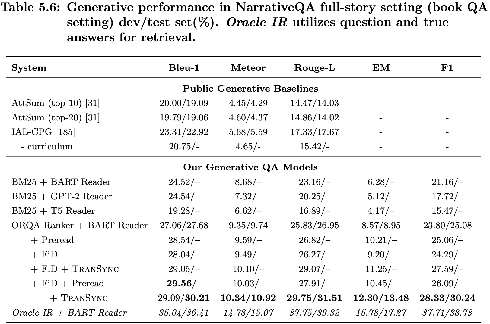

# PhD Dissertation #

The work is also included in my doctoral dissertation. Chapter 4 is about the ranker module and Chapter 5 is about the reader module. In Chapter 5, we also apply our latest __TranSync__ technique to the book QA task and push forward the SOTA performance by about 2 points (see Table 5.6).




Please cite our paper if you find __TranSync__ useful! :)
```bibtex
@article{mou2022efficient,
  title={Efficient Long Sequence Encoding via Synchronization},
  author={Mou, Xiangyang and Yu, Mo and Yao, Bingsheng and Huang, Lifu},
  journal={arXiv preprint arXiv:2203.07644},
  year={2022}
}
```

